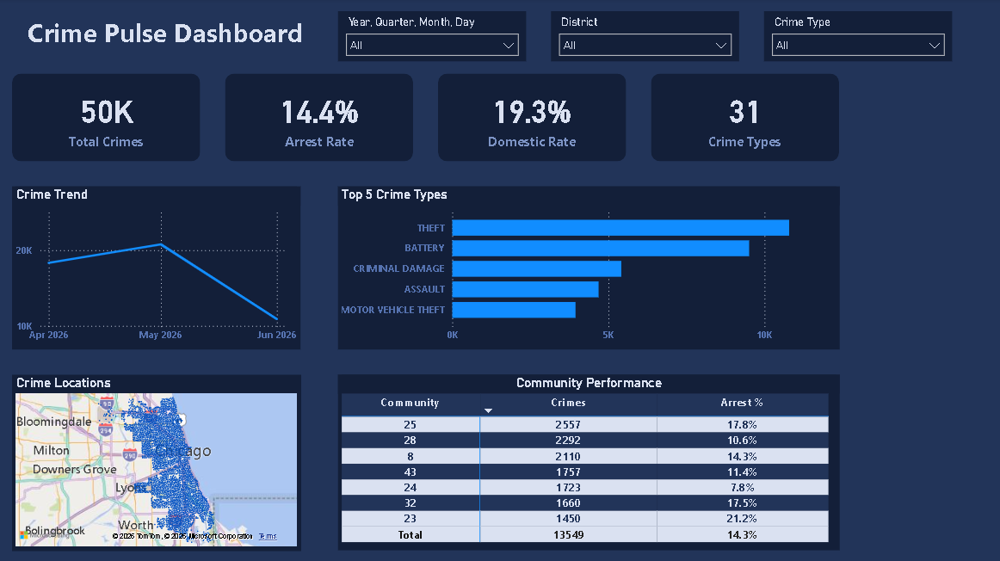

# 🔴 CrimePulse – Chicago Crime Analytics Platform

An end-to-end data engineering and machine learning project that analyzes and predicts crime patterns in Chicago using public data from the Chicago Open Data Portal.

---

## 📌 Project Overview

CrimePulse is a production-style data platform that:
- Ingests daily crime data from Chicago Open Data Portal
- Processes and stores data in Supabase PostgreSQL
- Automates the ETL pipeline using Apache Airflow
- Predicts crime counts per neighborhood using XGBoost
- Visualizes insights through Power BI Dashboard

---

## 🏗️ Architecture
Chicago Crime API

↓

Extract (Python)

↓

Transform (Python)

↓

Load → Supabase PostgreSQL

↓

Apache Airflow (Orchestration)

↓

┌──────────────┬──────────────┐

│   Power BI   │  ML Model    │

│  Dashboard   │  XGBoost     │

└──────────────┴──────────────┘

---

## 🗂️ Project Structure
CrimePulse/

├── extract/

│   ├── api_client.py      # Chicago Crime API client

│   └── extract.py         # Initial & Incremental load

├── transform/

│   ├── cleaners.py        # Data cleaning functions

│   ├── validators.py      # Data validation functions

│   └── transform.py       # Transform orchestration

├── load/

│   ├── db.py              # Database connection

│   └── load.py            # Load to Supabase

├── ml/

│   ├── train.py           # Model training (XGBoost)

│   └── predict.py         # Crime count prediction

├── dags/

│   └── crimepulse_dag.py  # Airflow DAGs

├── logger.py              # Logging setup

└── .gitignore

---

## 🛢️ Database Schema (Supabase PostgreSQL)

| Table | Description |
|---|---|
| `raw_crimes` | 50,000+ crime records |
| `daily_crimes_by_area` | Aggregated daily crimes per neighborhood |
| `etl_logs` | ETL pipeline monitoring |

---

## 🤖 Machine Learning

**Model:** XGBoost Regressor  
**Target:** Crime count per neighborhood per day  
**Features:**
- Time features: day_of_week, month, season, is_weekend
- Lag features: lag_1, lag_7, lag_30
- Rolling averages: rolling_avg_7, rolling_avg_30
- Area features: arrest_rate, domestic_rate

**Results:**
| Metric | Score |
|---|---|
| MAE | 2.08 |
| RMSE | 2.81 |
| R² | 0.76 |

---

## 📊 Dashboard



---

## 🛠️ Technologies

| Category | Tools |
|---|---|
| Language | Python 3.9 |
| Orchestration | Apache Airflow |
| Database | PostgreSQL (Supabase) |
| ML | XGBoost, Scikit-learn |
| Visualization | Power BI |
| Storage | Parquet |
| Version Control | Git & GitHub |

---

## ⚙️ Setup

```bash
# Clone the repository
git clone https://github.com/mohamedellaban91/CrimePulse.git
cd CrimePulse

# Install dependencies
pip install -r requirements.txt

# Set environment variables
cp config/.env.example config/.env
# Edit config/.env with your Supabase credentials

# Run ETL
python -m extract.extract initial
python -m transform.transform
python -m load.load

# Train ML model
python -m ml.train

# Predict
python -m ml.predict 43 7
```

---

## 📡 Data Source

[Chicago Open Data Portal](https://data.cityofchicago.org/resource/ijzp-q8t2.json)  
Update Frequency: Daily  
Coverage: Last 5 months

---

## 👤 Author

**Mohamed Ellaban**  
[GitHub](https://github.com/mohamedellaban91)
